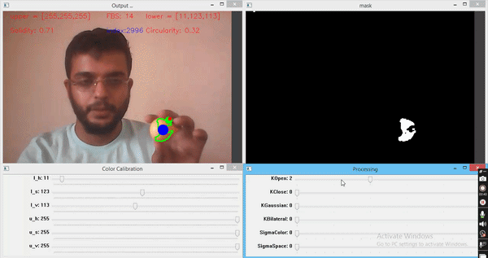

# Real-Time Object Tracking with OpenCV & Kalman Filter

A real-time computer vision project combining color segmentation,
contour analysis, and Kalman filtering for object tracking and prediction.

  

## 🎥 Project Videos

- [5-minute Demo]([YOUR_LINK](https://www.youtube.com/watch?v=tAHP9uk7Mbc&t=1s))
- [10-minute Project Presentation]([YOUR_LINK](https://www.youtube.com/watch?v=x6IYB1JJDP8&t=7s))

🚀 Installation

Install the required Python packages:

pip install numpy opencv-python matplotlib

Run the project:

python main.py

Press:

q

to exit the application.

---

⚠️ Engineering Challenges

The project was developed as a practical experiment rather than only a theoretical implementation.

The main challenges were:

- Maintaining real-time FPS on limited hardware
- Designing a reliable color-segmentation pipeline
- Handling noisy centroid measurements
- Selecting appropriate Kalman Filter parameters
- Understanding the effect of P, Q, R, and dt
- Handling invalid or missing visual measurements
- Maintaining prediction during temporary object disappearance

These challenges were used as part of the experimental analysis rather than being hidden from the final results.

---

🔭 Future Work

Possible extensions include:

- Adaptive Q and R
- Improved long-term occlusion handling
- Constant-acceleration motion model
- Multi-object tracking
- SORT / DeepSORT comparison
- More robust object detection
- Camera-motion compensation

---

👤 Author

Ali Wannous

Electronic Systems Engineering — HIAST, Damascus

Incoming Master's Student in Computer Vision — VIBOT
Université Bourgogne Europe, France

This project represents a practical bridge between Electronic Systems Engineering, Control Theory, and Computer Vision.
